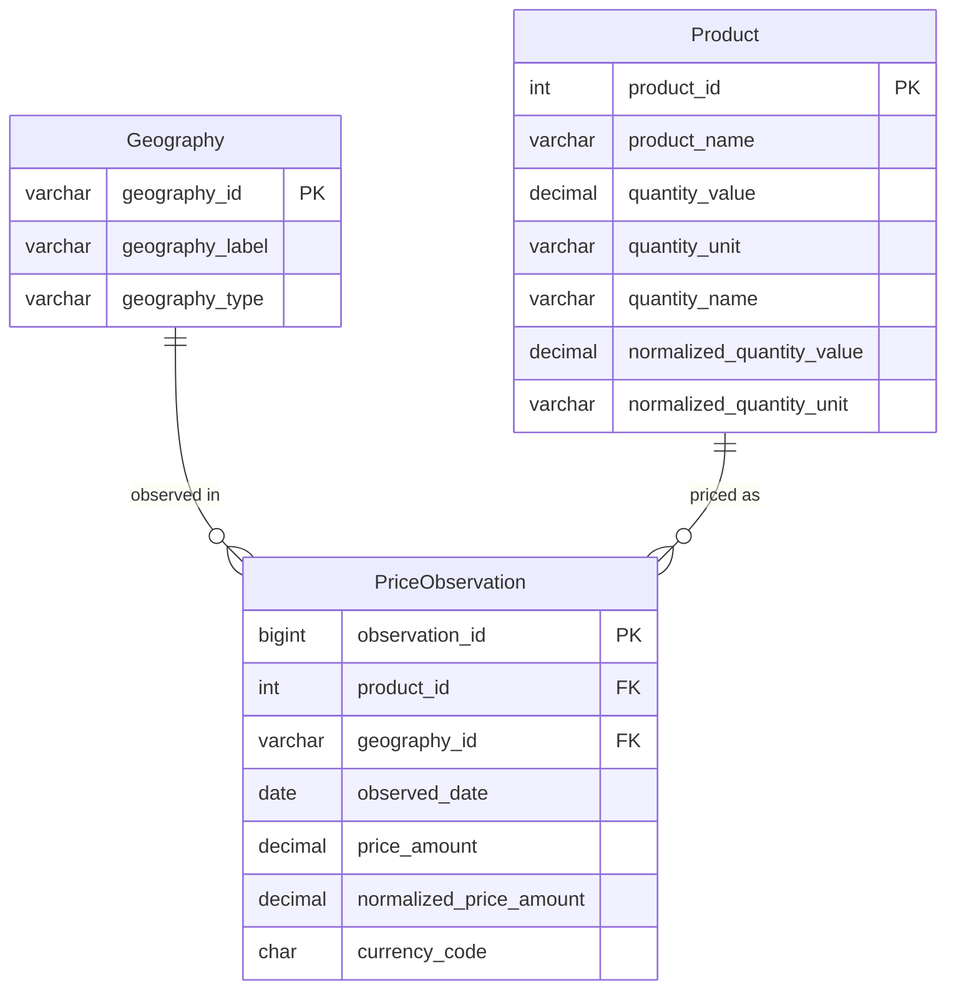

# LettucePriceAnalysis-SQL-
This small project uses a database of lettuce prices observed across 12 U.S markets over 29 days. SQL is used as a tool to discover some interesting facts about the observations

Daily retail lettuce prices, one row per price observation:

- 6,651 observations
- 12 US metro areas (by postal code)
- 37 distinct products (different brands/formats of lettuce)
- 29 days, 2026-07-13 to 2026-08-10

Columns: `series_id`, `series_title`, `canonical_url`, `geography_type`,
`geography_id`, `geography_label`, `observed_date`, `product_name`,
`quantity_value`, `quantity_unit`, `quantity_name`, `price_amount`,
`currency_code`, `normalized_price_amount`, `normalized_quantity_value`,
`normalized_quantity_unit`.

 Schema

The raw file lands in a flat staging table, then gets split into two
dimension tables and one fact table.



`series_id`, `series_title`, `canonical_url`, and `currency_code` are not
split into their own dimension tables — every row in this dataset shares the
same value for each (`lettuce`, `Lettuce`, one URL, `USD`), so a dimension
table there would carry zero information. `currency_code` stays as a column
on the fact table with a default, in case a future load introduces a second
currency.

 Setup

1. Create a database and load the CSV into a staging table — run
   [`sql/01_staging_table.sql`](sql/01_staging_table.sql), then either:
   - use SSMS's 
Import Flat File
 wizard to load the CSV into
     `dbo.Lettuce_Staging`, or
   - use the `BULK INSERT` statement commented at the bottom of that file.

   Numeric-looking columns (`price_amount`, `quantity_value`, etc.) are
   staged as `NVARCHAR`, not `FLOAT`/`DECIMAL`. SQL Server's import tooling
   parses numeric columns using the machine's regional decimal separator —
   on a comma-decimal locale, importing this period-decimal CSV straight
   into a numeric column throws `Input string was not in a correct format`.
   Staging as text sidesteps that entirely; conversion happens explicitly
   in step 3.

2. Create the normalized schema — run
   [`sql/02_schema.sql`](sql/02_schema.sql).

3. Populate it from staging — run
   [`sql/03_load_data.sql`](sql/03_load_data.sql). This dedupes staging
   down into `Geography` (12 rows) and `Product` (37 rows), then joins
   back to populate `PriceObservation` (6,651 rows). A validation block
   at the end checks the row counts line up.

4. Run the analysis — [`sql/04_analysis_queries.sql`](sql/04_analysis_queries.sql).

 Analysis queries

|  | Question | Technique |
|---|---|---|
| Q1 | Day-over-day price change per product per city | `LAG()` window function |
| Q2 | Cumulative inflation by city over the full period, ranked | CTE + `RANK()` |
| Q3 | Which products are most/least volatile in price | `STDEV()` aggregate |
| Q4 | Cheapest product per city per day | CTE + `RANK()` |
| Q5 | Same-day/city/product listings with outlier prices | `PERCENTILE_CONT()` window function |

 Sample findings (computed from this dataset)

Cumulative inflation by city (average normalized price, first observed day vs. last):

| City | First day | Last day | Change |
|---|---|---|---|
| Jackson, MS – North Jackson | $16.82 | $21.07 | +25.3% |
| Houston, TX – Midtown | $12.33 | $15.38 | +24.7% |
| East St. Louis, IL | $14.77 | $16.62 | +12.5% |
| ⋯ | | | |
| New York, NY – Ridgewood/Glendale | $17.72 | $14.27 | −19.5% |
| Jacksonville, FL – Westside | $14.26 | $10.06 | −29.4% |

Same 29-day window, same product category, and the twelve cities range from
+25% to −29%. That spread is the headline finding of this project — national
CPI-style averages hide enormous local variation, and this dataset makes that
concrete rather than abstract.

Most volatile product: *Fresh Iceberg Lettuce by RawJoy Farms*, mean
price $44.17 with a standard deviation of $11.67 — by far the widest swing
of any of the 37 products, and the source of the price anomalies Q5 flags
(e.g. the same product, city, and day showing $30.99, $40.09, and $60.85
side by side — a ~1.52x spread, almost certainly multiple retailers or
listings sharing one product name in the source data).

Least volatile products: several single-retailer organic butter/leaf
lettuces (Bristol Farms, Produce Organic) show zero price variation
across the entire month — same price on every single day it was observed.

 Repo structure

```
.
├── README.md
├── data/
│   └── costinflation-lettuce-retail-prices-raw-2026-07-13-to-2026-08-10.csv
└── sql/
    ├── 01_staging_table.sql
    ├── 02_schema.sql
    ├── 03_load_data.sql
    └── 04_analysis_queries.sql
```
